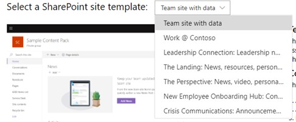

# 将示例数据包与 Microsoft 365 开发人员计划订阅结合使用

可以在 Microsoft 365 开发人员计划订阅上安装示例数据包。 示例数据包可自动安装构建和测试解决方案所需的数据和内容，从而节省你的时间。 其中包含虚构用户、元数据和照片，用于模拟小型企业环境。 你可以快速安装示例数据，以便专注于你的解决方案，而不是花时间亲自创建示例数据。

可以在订阅磁贴底部的 [Microsoft 365 开发人员计划仪表板](https://developer.microsoft.com/office/profile)上找到示例数据包。

目前提供以下示例数据包：

- 用户 - 安装 16 个具有许可证、邮箱和元数据（包括每位用户的姓名和照片）的虚构用户。 通过下列方式使用 Microsoft Graph API 处理用户示例数据：
  - 获取特定用户详细信息
  - 更新用户
  - 获取直接报告
  - 准备组织结构图  
  - 按部门获取用户

- 邮件和事件 - 为 16 个示例用户中的每一位添加 Outlook 电子邮件会话和日历事件。 通过下列方式使用 Microsoft Graph API 处理邮件和事件示例数据：
  - 按用户获取电子邮件
  - 按筛选日期获取电子邮件
  - 获取即将开始的事件
  - 更新/删除即将开始的事件

> [!NOTE]
> 在安装邮件和事件之前，你必须先安装用户示例数据包。

## 示例数据包会将什么添加到我的订阅中？

用户示例数据包将在你的订阅上创建 16 个虚构用户，并包含每位用户的许可证、邮箱、姓名、元数据和照片。

邮件和事件示例数据包将为已安装的 16 个用户中的每一位添加 Outlook 电子邮件会话和日历事件。

## 如何安装用户示例数据包？

安装“用户”示例数据包前，请先确保你有 Microsoft 365 开发人员订阅，并以管理员身份为自己分配许可证。

> [!NOTE]
> 确保你的订阅中有 16 位用户空闲。 你的订阅包含 25 位用户。 如果你配置的用户数已超过 10 位，则请先删除一些用户，确保安装功能。

若要安装用户示例数据包，请执行下列操作：

1. 选择订阅磁贴底部的“**用户**”框。
2. 复制你的管理员 ID；你需要它来登录你的订阅。
3. 在登录页面上输入你的管理员 ID 和密码。
4. 以 Microsoft 365 开发人员订阅管理员身份许可权限。

5. 为所有示例用户配置密码。需要定义一个共享密码，以便轻松管理所有虚构用户。

6. 系统将安装数据。 安装过程大约需要 5 分钟时间。

7. 安装完成后，你将收到电子邮件通知，订阅磁贴上的框将显示为绿色。 你现在可以安装邮件和事件示例数据包。

## 如何安装邮件和事件示例数据包？

安装用户示例数据包后，你可以安装邮件和事件。

1. 选择订阅磁贴上的“**邮件和事件**”框。
2. 选择“**安装**”以开始安装。

> [!NOTE]
> 如果你刚刚创建了订阅，则必须先完整配置它，然后才能开始安装。 这可能需要几个小时。 安装开始后，最多可能需要 20 分钟才能完成。

3. 安装完成后，你将收到电子邮件通知，订阅磁贴上的框将显示为绿色。

## 如何安装 SharePoint 示例数据包？

SharePoint 示例数据包有七个不同的 SharePoint 网站模板可供选择，以体验和模拟用于协作、通信、参与和知识管理的 SharePoint 解决方案。

这些是 [SharePoint PnP 外观手册](https://provisioning.sharepointpnp.com/) 中最受欢迎模板的一部分。 现在，创建美观、快速且在任何设备或屏幕上看起来非常精美的网站和页面的示例解决方案十分简单。 通过这些设计获取灵感，或将其添加到沙盒租户，以开始构建下一个网站。

这些模板可以安装在你的订阅中。 安装一个模板后，可选择安装其他模板。 安装过程包括以下步骤：

1. 从下拉菜单中选择所需模板。

  

2. 为网站配置自定义选项或接受默认值。
3. 使用沙盒租户和密码的管理员 ID 进行身份验证并授予安装权限。 

安装将自动继续。

>**注意：** 这些网站模板的设置仅适用于英文版 Office 365 E3 或 Microsoft 365 E5 开发人员订阅，并且其中包含的所有内容均只提供英语版。

## 提供了哪些 SharePoint 模板？

SharePoint 示例包由七个不同的模板组成。

### 带有数据的团队网站

此模板包括多个列表和文档库，它们与某个 SharePoint 团队网站自动关联，可帮助你使用 SharePoint 框架、Power Apps 和 Microsoft Graph 开发解决方案。

此模板包含以下数据：

- 包含预填充联系人的联系人列表
- 填充了 6000 个项目以上的列表
- 包含 PowerPoint、Excel、Word 和 OneNote 文档示例的文档库
- 包含公告项的事件列表

此模板与用户示例数据集成。

### Work @ Contoso
Work @ Contoso 模板包含多个网站集，均与中心网站自动关联，以显示所有默认聚合功能的工作方式。

此模板包含以下结构和资产：

- 设置为中心网站的主网站集
- 两个与中心网站相关联的通信网站 - 权益与慈善网站
- 一个与中心网站团队网站相关联的组团队网站
- 子网站集中的示例新闻文章
- Word、Excel 和 PowerPoint 示例文件
- 网站集内的示例图像内容

子网站集使用相同的模板，也可以从此服务中单独预配。

>**注意：** 如果在现有通信网站上应用此模板，将覆盖该网站的欢迎页面内容。

### 领导力连接：领导力新闻、活动、参与

此领导力网站提供了对领导力团队目标和优先事项的见解，并鼓励参与活动与对话。

将此设计添加到租户将创建以下内容：

- 带有 Web 部件演示的示例欢迎页面
- 演示不同新式页面设计的示例新闻文章

此模板与用户示例数据集成。

### 登陆：新闻、资源、个性化内容

此通信网站旨在为员工提供所需的新闻和资源，以及专为他们量身定制的个性化内容。

将此设计添加到租户将创建以下内容：

- 门户主页网站的演示结构
- 自定义欢迎页面结构
- 其他 6 个示例新式页面和新闻文章
- 示例图像和 Office 文档

### 透视：新闻、视频、个性化内容

该网站旨在提供新闻和个性化内容，还包括可用于鼓励更多参与的视频。
将此设计添加到租户将创建以下内容：

- 自定义欢迎页面设计
- 新闻文章的示例页面模板
- 12 篇示例新闻文章

### 新员工加入中心：联系、参与、通知

通过预构建的模板（包括预加入、公司级加入和部门级加入方案），简化和优化新员工的入职流程。 此数字解决方案提供了 4 种不同的网站模板，其中包含可以自定义以适应组织目标的预填充内容。

将此设计添加到租户将创建以下内容：

- 预入职网站、公司入职网站和两个部门入职网站
- 每个网站的自定义和预填充主页
- 公司入职的已配置中心网站和部门入职的已关联网站
- SharePoint 列表上的新员工清单，帮助新员工成功入职
- “人员” Web 部件、Yammer Web 部件、“新闻” Web 部件和“快速链接” Web 部件的示例内容
- 为每个网站预编写的常见问题解答
- 创建社交和参与体验的建议，例如，在预入职网站上使用 YouTube Web 部件包含欢迎视频

### 紧急通信：公告、新闻、资源、社区和行动号召

在从极端天气事件到卫生和安全紧急事件等各种危机期间，让人们了解情况、参与并向前推进。 该模板创建一个中央资源，供领导或通信者共享重要新闻和公告，是人们了解最新资讯的单一事实来源，也是连接整个组织人员的地方。

将此设计添加到租户将创建以下内容：

- 使用 Web 部件构建的自定义欢迎页面
- 4 篇带有示例内容的新闻文章

此模板与用户示例数据集成。

## 是否会推出更多示例数据包？

是。 将来，我们将考虑为包括 Microsoft Teams 在内的更多产品和技术添加示例数据包。 如果你有关于希望查看的示例数据包的建议，请 [告知我们](https://officespdev.uservoice.com/forums/224641-feature-requests-and-feedback?category_id=171306)。

## 能否在其他 Microsoft 365 订阅上安装示例数据包？

否。这些示例数据包仅与作为 Microsoft 365 开发人员计划一部分获取的 Microsoft 365 开发人员订阅兼容。

## 如何查看我的订阅中的示例数据？

安装用户示例数据包后，若要查看已添加的用户，请在 Microsoft 365 开发人员订阅上转到 [**Microsoft 365 管理中心**](https://admin.microsoft.com/)。 在“**用户**”下，选择“**活动用户**”。 你将会看到包含 16 个用户的列表。 你可以选择一个用户来查看相关联的元数据，包括照片和许可证。

安装邮件和事件示例包后，若要查看示例数据，请在 [**Microsoft 365 管理中心**](/microsoft-365/admin/admin-overview/about-the-admin-center?view=o365-worldwide) 内选择“**全部显示**”，然后选择“**Exchange**”。 在 Exchange 管理中心内，当你选择“**收件人**”时，你可以看到 16 个用户均拥有添加了邮件和事件的邮箱。

## 另请参阅

- [设置 Microsoft 365 开发人员订阅](microsoft-365-developer-program-get-started.md)
