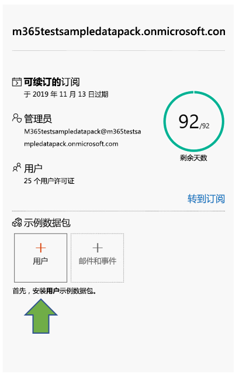
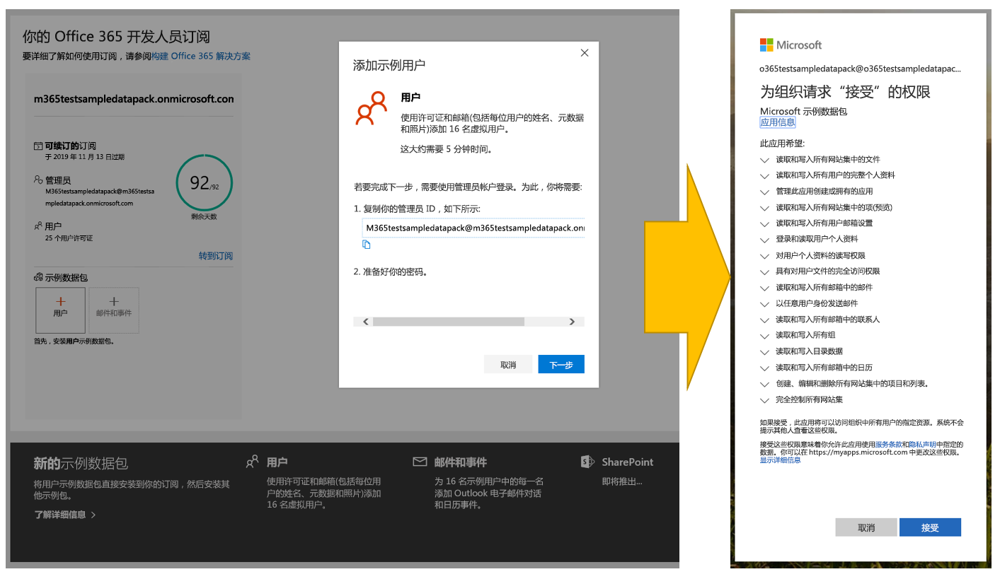
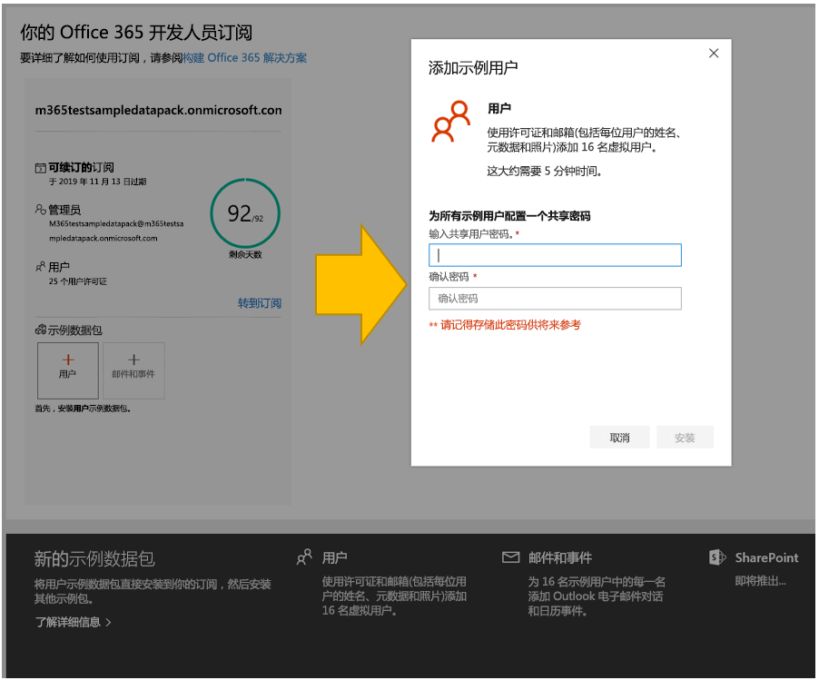
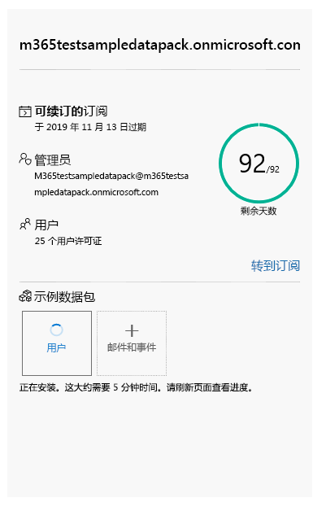
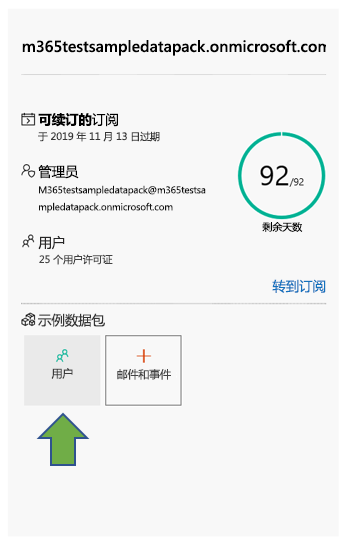
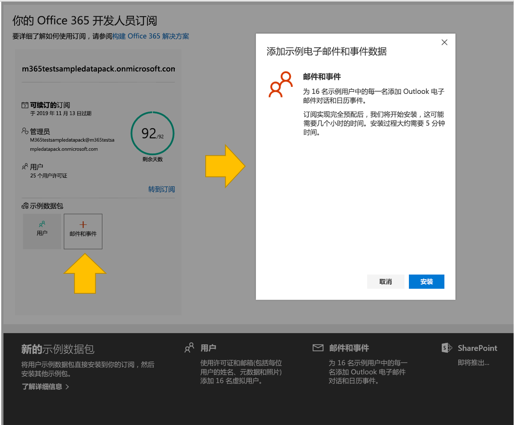
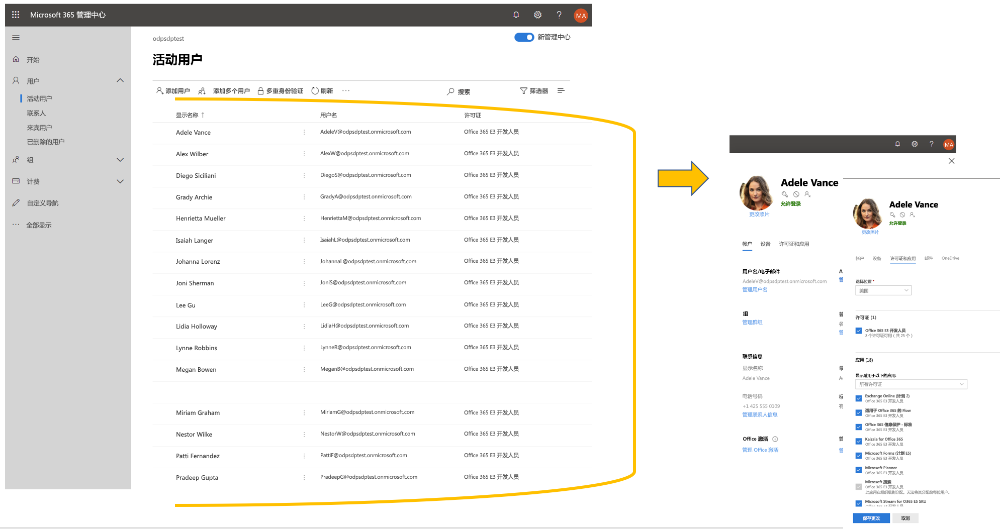
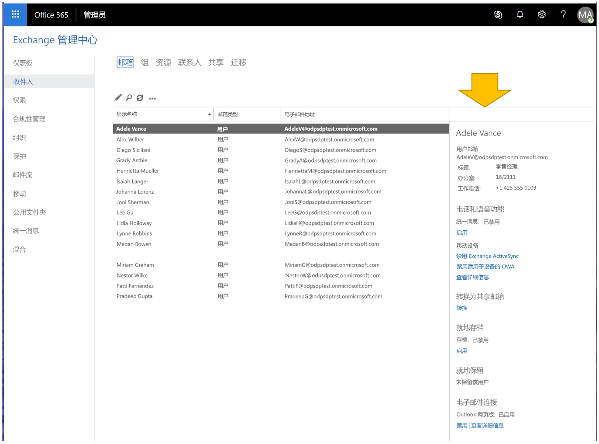

# 将示例数据包与 Office 365 开发人员订阅结合使用Use sample data packs with your Office 365 developer subscription

你可以在 Office 365 开发人员订阅上安装示例数据包。You can install sample data packs on your Office 365 developer subscription. 示例数据包可自动安装构建和测试解决方案所需的数据和内容，从而节省你的时间。Sample data packs save you time by automatically installing data and content you need to build and test your solutions. 其中包含虚构用户、元数据和照片，用于模拟小型企业环境。This includes fictitious users, metadata, and photos to simulate a small corporate environment. 你可以快速安装示例数据，以便专注于你的解决方案，而不是花时间亲自创建示例数据。You can quickly install the sample data so that you can focus on your solutions rather than spend time creating sample data yourself.

你可以在 Office 365 订阅磁贴底部的 [Office 365 开发人员计划仪表板](https://developer.microsoft.com/office/profile)上找到示例数据包。You can find sample data packs on your [Office 365 Developer Program dashboard](https://developer.microsoft.com/office/profile), at the bottom of your Office 365 subscription tile.

目前提供以下示例数据包：The following sample data packs are currently available:

- 用户 - 安装 16 个具有许可证、邮箱和元数据（包括每位用户的姓名和照片）的虚构用户。Users - Installs 16 fictitious users with licenses, mailboxes, and metadata, including names and photos for each user. 通过下列方式使用 Microsoft Graph API 处理用户示例数据：Use Microsoft Graph APIs to work with user sample data in the following ways:
  - 获取特定用户详细信息Get specific user details
  - 更新用户Update user
  - 获取直接报告Get user's direct reports.
  - 准备组织结构图Prepare organization chart  
  - 按部门获取用户Get users by department

- 邮件和事件 - 为 16 个示例用户中的每一位添加 Outlook 电子邮件会话和日历事件。Mail and events - Adds Outlook email conversations and calendar events for each of the 16 sample users. 通过下列方式使用 Microsoft Graph API 处理邮件和事件示例数据：Use Microsoft Graph APIs to work with mail and events sample data in the following ways:
  - 按用户获取电子邮件Get emails by users
  - 按筛选日期获取电子邮件Get emails filtered by date
  - 获取即将开始的事件Get upcoming events
  - 更新/删除即将开始的事件Update/delete upcoming events

> [!NOTE]
> 在安装邮件和事件之前，你必须先安装用户示例数据包。You must install the Users sample data pack before you install Mail and Events.

## 示例数据包会将哪些内容添加到我的 Office 365 订阅？What do the sample data packs add to my Office 365 subscription?

用户示例数据包将在你的订阅上创建 16 个虚构用户，并包含每位用户的许可证、邮箱、姓名、元数据和照片。The Users sample data pack creates 16 fictitious users on your subscription, and includes the licenses for each user, and mailboxes, names, metadata, and photos for each.

邮件和事件示例数据包将为已安装的 16 个用户中的每一位添加 Outlook 电子邮件会话和日历事件。The Mail and Events sample data pack adds Outlook email conversations and calendar events for each of the 16 users installed.

## 如何安装用户示例数据包？How do I install the Users sample data pack?

在安装用户示例数据包之前，请确保你拥有 Office 365 开发人员订阅，并以管理员身份为自己分配许可证。Before you install the Users sample data pack, make sure that you have an Office 365 developer subscription and that you assign a license to yourself as the admin.

> [!NOTE]
> 确保你的订阅中有 16 位用户空闲。Make sure that you have 16 users available in your subscription. 你的订阅包含 25 位用户。Your subscription includes 25 users. 如果你配置的用户数已超过 10 位，则请先删除一些用户，确保安装功能。If you have already configured more than 10 users, remove some users first to ensure that your installation is successful.

若要安装用户示例数据包，请执行下列操作：To install the Users sample data pack:

1. 选择订阅磁贴底部的“**用户**”框。Select the **Users** box at the bottom of your subscription tile.
2. 复制你的管理员 ID；你需要它来登录你的订阅。Copy your administrator ID; you will need it to sign in to your subscription.
3. 在登录页面上输入你的管理员 ID 和密码。Enter your administrator ID and password on the sign in page.
4. 以 Office 365 开发人员订阅的管理员身份给予相关许可权限。Consent to the permissions as an administrator of your Office 365 developer subscription.

5. 为所有示例用户配置密码。Configure your passwords for all sample users. 你需要定义一个共享密码，以便轻松管理所有虚构用户。You will need to have one shared password defined for easy administration of all your fictitious users.

6. 系统将安装数据。The existing data will be overwritten. 安装过程大约需要 5 分钟时间。The installation should take about 5 minutes.

7. 安装完成后，你将收到电子邮件通知，订阅磁贴上的框将显示为绿色。When installation is finished, you'll be notified by email, and the box on your subscription tile will be green. 你现在可以安装邮件和事件示例数据包。You can now install the Mail and Events sample data pack.

## 如何安装邮件和事件示例数据包？How do I install the Mail and Events sample data pack?

安装用户示例数据包后，你可以安装邮件和事件。After you've installed the Users sample data pack, you can install mail and events.

1. 选择订阅磁贴上的“**邮件和事件**”框。Choose the **Mail &amp; Events** box on your subscription tile.
2. 选择“**安装**”以开始安装。Click **Install** to begin the installation.

> [!NOTE]
> 如果你刚刚创建了订阅，则必须先完整配置它，然后才能开始安装。If you just created your subscription, it must be fully provisioned before installation can begin. 这可能需要几个小时。This can take up to a few hours. 安装开始后，最多可能需要 20 分钟才能完成。After installation starts, it can take up to 20 minutes to finish.

3. 安装完成后，你将收到电子邮件通知，订阅磁贴上的框将显示为绿色。When installation is finished, you'll be notified by email, and the box on your subscription tile will be green.

## 是否会推出更多示例数据包？Are more sample data packs coming?

是。Yes. 我们将为 SharePoint 和 OneDrive 添加示例数据包。We will add sample data packs for SharePoint and OneDrive. 将来，我们将考虑为更多产品和技术添加示例数据包，包括 Office 加载项、Microsoft Teams 等。In the future, we will consider adding sample data packs for more products and technologies, including Office Add-ins, Microsoft Teams, and more.

## 能否在其他 Office 365 订阅上安装示例数据包吗？Can I install sample data packs on my other Office 365 subscriptions?

否。No. 这些示例数据包仅与 Office 365 开发人员订阅（作为 Office 365 开发人员计划的一部分获得）兼容。These sample data packs are only compatible with the Office 365 Developer Subscription you get as part of the Office 365 Developer Program.

## 如何查看我的订阅中的示例数据？How can I see the sample data in my subscription?

安装用户示例数据包后，若要查看添加的用户，请在 Office 365 开发人员订阅上转到 **Microsoft 365 管理中心**。After you install the Users sample data pack, to see the users that were added, go to the **Microsoft 365 Admin Center** on your Office 365 developer subscription. 在“**用户**”下，选择“**活动用户**”。Under **Users**, select **Active users**. 你将会看到包含 16 个用户的列表。You will see the list of 16 users. 你可以选择一个用户来查看相关联的元数据，包括照片和许可证。You can select a user to view the associated metadata, including photos and licenses.

安装邮件和事件示例包后，若要查看示例数据，请在 **Microsoft 365 管理中心**内选择“**全部显示**”，然后选择“**Exchange**”。After you install the Mail and Events sample pack, to see the sample data, in the **Microsoft 365 Admin Center**, choose **Show all** and then select **Exchange**. 在 Exchange 管理中心内，当你选择“**收件人**”时，你可以看到 16 个用户均拥有添加了邮件和事件的邮箱。In the Exchange admin center, when you select **recipients**, you can see that each of the 16 users has mailboxes with mail and events added.

## 另请参阅See also

- [设置 Office 365 开发人员订阅Set up an Office 365 developer subscription](office-365-developer-program-get-started.md)
