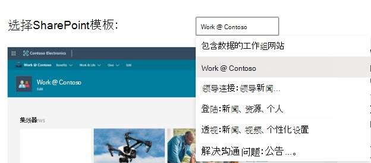

# 开发人员沙盒示例数据

Microsoft 365 开发人员计划沙盒订阅附带示例数据，可提供生成和测试解决方案所需的数据和内容，从而节省时间。

## 在即时沙盒上安装的示例数据

如果有即时沙盒，则表明示例数据包已预安装。 即时沙盒包含以下示例数据：

- **Microsoft Graph 用户、邮件和日历数据** - 16 个具有用户数据和内容的示例用户，可帮助你为解决方案建模。 这包括用户邮箱、日历事件，以及与具有模拟聊天和团队成员身份的 Teams 开发人员环境的集成。
- **Teams 示例数据包** 具有以下自定义开发人员环境：
  - 已预配置 **应用旁加载**
  - 已围绕 16 个示例用户构建 **五个示例团队、频道、选项卡和聊天会话**。
  - **已预安装并固定 App Studio/Teams 开发人员门户**，以帮助简化 Teams 应用清单和应用包的创建，以及卡片编辑器和 React 控件库。
    
    
- **SharePoint 框架示例数据** - 从六个网站模板中进行选择，可将这些模板作为组织的自定义解决方案（预安装一个）进行安装和评估。

## 在可配置沙盒中安装示例数据包

如果你有一个可配置的沙盒，则可以快速安装示例数据，以便你可以专注于解决方案，而不是花时间亲自创建示例数据。

> [!NOTE] 
> 无法在任何其他 Microsoft 365 订阅上安装示例数据包。 这些示例数据包仅与作为 Microsoft 365 开发人员计划的一部分获取的 Microsoft 365 开发人员沙盒订阅兼容。

可以在订阅磁贴底部的 [Microsoft 365 开发人员计划仪表板](https://developer.microsoft.com/microsoft-365/profile)上找到示例数据包。

目前提供以下示例数据包：

- 用户 - 安装 16 个具有许可证、邮箱和元数据（包括每位用户的姓名和照片）的虚构用户。 通过下列方式使用 Microsoft Graph API 处理用户示例数据：
  - 获取特定用户详细信息
  - 更新用户
  - 获取直接报告
  - 准备组织结构图  
  - 按部门获取用户

- 邮件和事件 - 为 16 个示例用户中的每一位添加 Outlook 电子邮件会话和日历事件。 通过下列方式使用 Microsoft Graph API 处理邮件和事件示例数据：
  - 按用户获取电子邮件
  - 按筛选日期获取电子邮件
  - 获取即将开始的事件
  - 更新/删除即将开始的事件

  > [!NOTE]
  > 在安装邮件和事件之前，你必须先安装用户示例数据包。
    
- SharePoint 框架示例数据 - 从六个网站模板中进行选择，可将这些模板作为组织的自定义解决方案（预安装一个）进行安装和评估。

### 安装用户示例数据包

安装“用户”示例数据包前，请先确保你有 Microsoft 365 开发人员订阅，并以管理员身份为自己分配许可证。

> [!NOTE]
> 确保你的订阅中有 16 位用户空闲。 你的订阅包含 25 位用户。 如果你配置的用户数已超过 10 位，则请先删除一些用户，确保安装功能。

若要安装用户示例数据包，请执行下列操作：

1. 选择订阅磁贴底部的“**用户**”框。
2. 复制你的管理员 ID；你需要它来登录你的订阅。
3. 在登录页面上输入你的管理员 ID 和密码。
4. 以 Microsoft 365 开发人员订阅管理员身份许可权限。

  

5. 为所有示例用户配置密码。需要定义一个共享密码，以便轻松管理所有虚构用户。

  

6. 系统将安装数据。 安装过程大约需要 5 分钟时间。

  

7. 安装完成后，你将收到电子邮件通知，订阅磁贴上的框将显示为绿色。 你现在可以安装邮件和事件示例数据包。

  

### 安装邮件和事件示例数据包

安装用户示例数据包后，你可以安装邮件和事件。

1. 选择订阅磁贴上的“**邮件和事件**”框。
2. 选择“**安装**”以开始安装。

  

  > [!NOTE]
  > 如果你刚刚创建了订阅，则必须先完整配置它，然后才能开始安装。 这可能需要几个小时。 安装开始后，最多可能需要 20 分钟才能完成。

3. 安装完成后，你将收到电子邮件通知，订阅磁贴上的框将显示为绿色。

### 安装 SharePoint 示例数据包

SharePoint 示例数据包有六个不同的 SharePoint 网站模板可供选择，以体验和模拟用于协作、通信、参与和知识管理的 SharePoint 解决方案。

这些是 [SharePoint PnP 外观手册](https://provisioning.sharepointpnp.com/) 中最受欢迎模板的一部分。 现在，创建美观、快速且在任何设备或屏幕上看起来非常精美的网站和页面的示例解决方案十分简单。 通过这些设计获取灵感，或将其添加到沙盒租户，以开始构建下一个网站。

这些模板可以安装在你的订阅中。 安装一个模板后，可选择安装其他模板。 安装过程包括以下步骤：

1. 从下拉菜单中选择所需模板。

  

2. 为网站配置自定义选项或接受默认值。
3. 使用沙盒租户和密码的管理员 ID 进行身份验证并授予安装权限。 

安装将自动继续。

>**注意：** 这些网站模板的设置仅适用于英文版 Office 365 E3 或 Microsoft 365 E5 开发人员订阅，并且其中包含的所有内容均只提供英语版。

#### 提供了哪些 SharePoint 模板？

SharePoint 示例包由七个不同的模板组成。

#### 带有数据的团队网站

此模板包括多个列表和文档库，它们与某个 SharePoint 团队网站自动关联，可帮助你使用 SharePoint 框架、Power Apps 和 Microsoft Graph 开发解决方案。

此模板包含以下数据：

- 包含预填充联系人的联系人列表
- 填充了 6000 个项目以上的列表
- 包含 PowerPoint、Excel、Word 和 OneNote 文档示例的文档库
- 包含公告项的事件列表

此模板与用户示例数据集成。

#### Work @ Contoso
Work @ Contoso 模板包含多个网站集，均与中心网站自动关联，以显示所有默认聚合功能的工作方式。

此模板包含以下结构和资产：

- 设置为中心网站的主网站集
- 两个与中心网站相关联的通信网站 - 权益与慈善网站
- 一个与中心网站团队网站相关联的组团队网站
- 子网站集中的示例新闻文章
- Word、Excel 和 PowerPoint 示例文件
- 网站集内的示例图像内容

子网站集使用相同的模板，也可以从此服务中单独预配。

>**注意：** 如果在现有通信网站上应用此模板，将覆盖该网站的欢迎页面内容。

#### 领导力连接：领导力新闻、活动、参与

此领导力网站提供了对领导力团队目标和优先事项的见解，并鼓励参与活动与对话。

将此设计添加到租户将创建以下内容：

- 带有 Web 部件演示的示例欢迎页面
- 演示不同新式页面设计的示例新闻文章

此模板与用户示例数据集成。

#### 登陆：新闻、资源、个性化内容

此通信网站旨在为员工提供所需的新闻和资源，以及专为他们量身定制的个性化内容。

将此设计添加到租户将创建以下内容：

- 门户主页网站的演示结构
- 自定义欢迎页面结构
- 其他 6 个示例新式页面和新闻文章
- 示例图像和 Office 文档

#### 透视：新闻、视频、个性化内容

该网站旨在提供新闻和个性化内容，还包括可用于鼓励更多参与的视频。
将此设计添加到租户将创建以下内容：

- 自定义欢迎页面设计
- 新闻文章的示例页面模板
- 12 篇示例新闻文章

#### 紧急通信：公告、新闻、资源、社区和行动号召

在从极端天气事件到卫生和安全紧急事件等各种危机期间，让人们了解情况、参与并向前推进。 该模板创建一个中央资源，供领导或通信者共享重要新闻和公告，是人们了解最新资讯的单一事实来源，也是连接整个组织人员的地方。

将此设计添加到租户将创建以下内容：

- 使用 Web 部件构建的自定义欢迎页面
- 4 篇带有示例内容的新闻文章

此模板与用户示例数据集成。

## 能否在其他 Microsoft 365 订阅上安装示例数据包？

否。这些示例数据包仅与作为 Microsoft 365 开发人员计划一部分获取的 Microsoft 365 开发人员订阅兼容。

## 如何查看我的订阅中的示例数据？

若要查看用户示例数据，请在 Microsoft 365 开发人员订阅上转到 [**Microsoft 365 管理中心**](https://admin.microsoft.com/)。 在“**用户**”下，选择“**活动用户**”。 你将会看到包含 16 个用户的列表。 你可以选择一个用户来查看相关联的元数据，包括照片和许可证。

若要查看邮件和事件示例数据，请在 [**Microsoft 365管理中心**](/microsoft-365/admin/admin-overview/about-the-admin-center?view=o365-worldwide)中，选择“**全部显示**”，然后选择“**Exchange**”。 在 Exchange 管理中心内，当你选择“**收件人**”时，你可以看到 16 个用户均拥有添加了邮件和事件的邮箱。

若要查看 Microsoft Teams 示例数据，请转到 Microsoft 365 E5 订阅中的“**Teams**”。 在“Teams”选项卡上，你将看到一些预先创建的团队与 **Mark 8 项目团队** 中的示例用户聊天。 App Studio/Dev Portal 应用已预安装并固定到导航窗格。

若要查看 SharePoint 示例数据，请转到 SharePoint 管理中心，然后在左侧导航栏中选择“**活动网站**”。 可以看到预安装的示例网站以及在沙盒中安装的任何其他网站模板。

## 另请参阅

- [设置 Microsoft 365 开发人员订阅](microsoft-365-developer-program-get-started.md)
