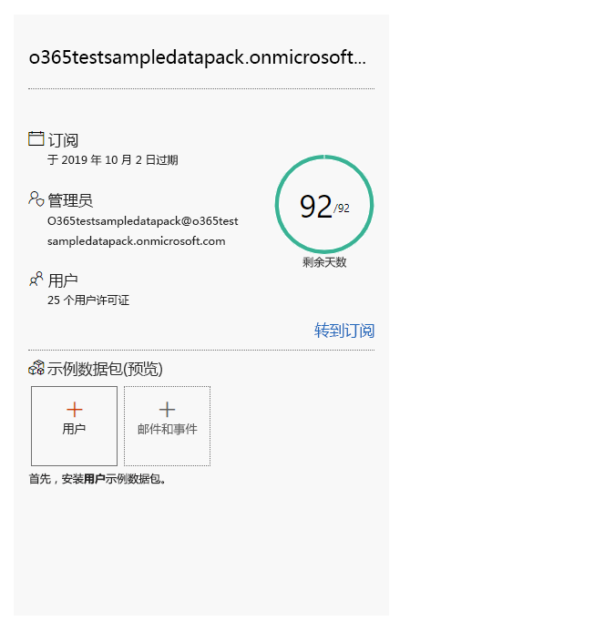
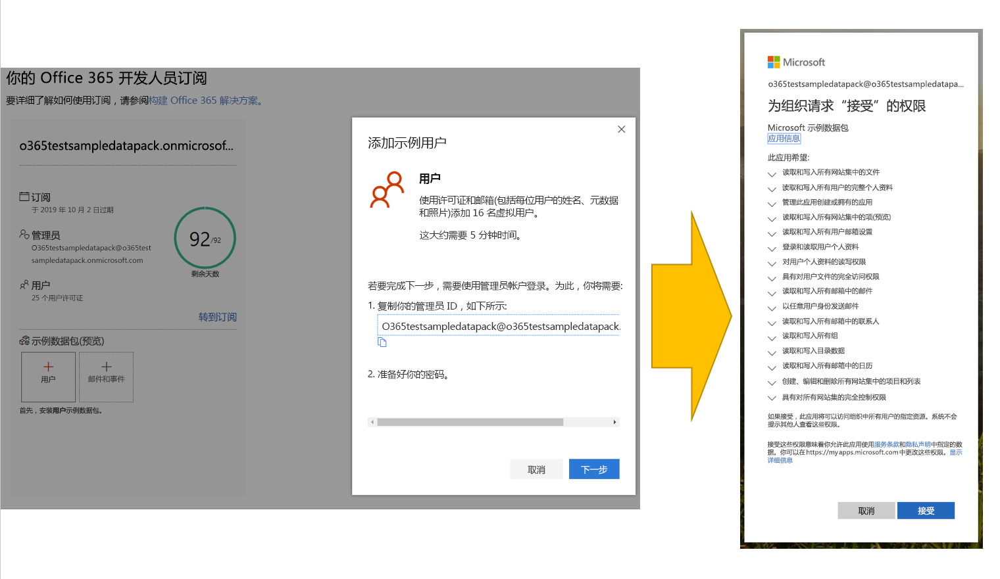
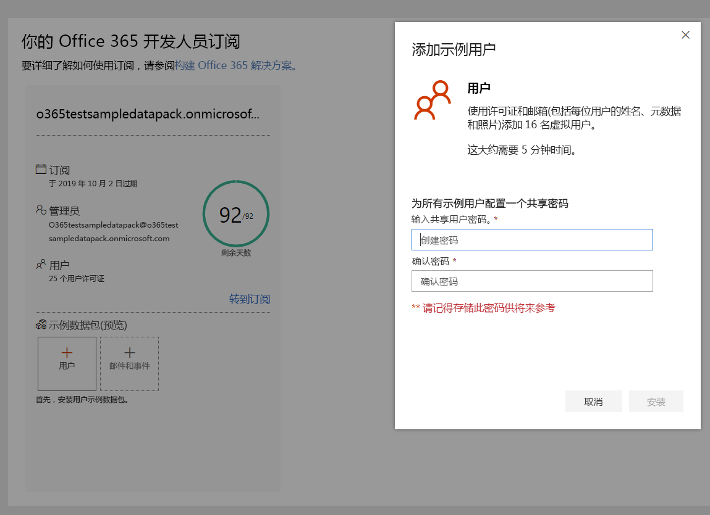
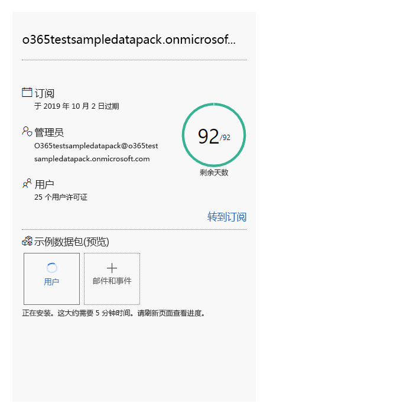
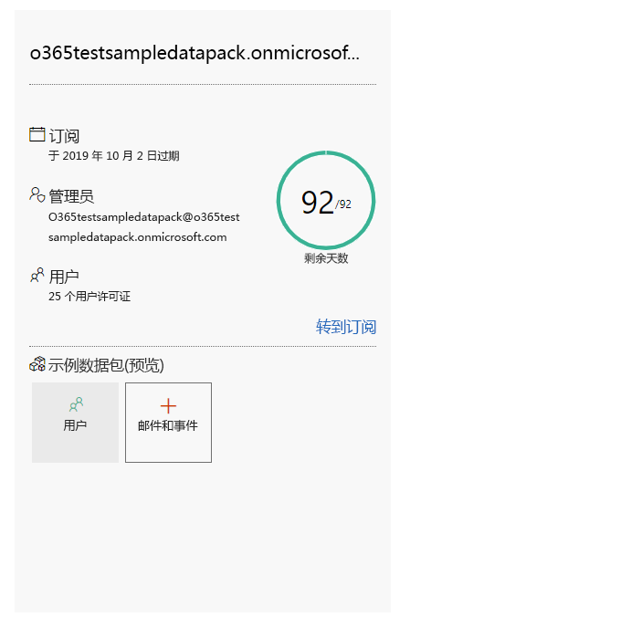
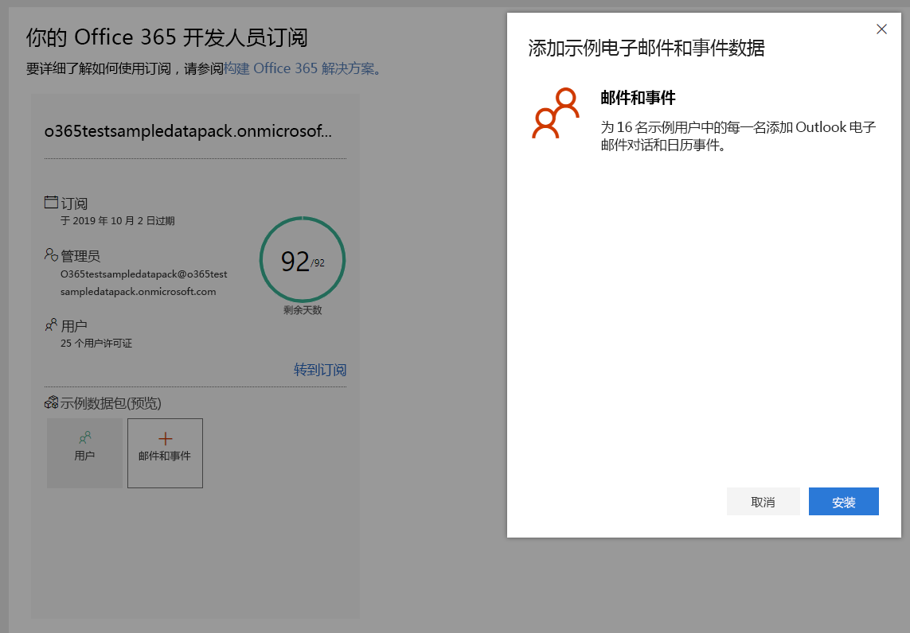

# 将示例数据包与 Office 365 开发人员订阅结合使用

你可以在 Office 365 开发人员订阅上安装示例数据包。 通过自动安装构建和测试解决方案所需的数据和内容，示例数据包可以节省你的时间。 其中包含虚构用户、元数据和照片，用于模拟小型企业环境。 你可以快速安装示例数据，以便专注于你的解决方案，而不是花时间亲自创建示例数据。

你可以在 Office 365 订阅磁贴底部的 [Office 365 开发人员计划仪表板](https://developer.microsoft.com/office/profile)上找到示例数据包。

目前提供以下示例数据包：

- 用户 - 安装具有许可证、邮箱和元数据（包括每位用户的姓名和照片）的 16 个虚构用户。 使用 Microsoft Graph API 以下列方式处理用户示例数据：
  - 获取特定用户详细信息
  - 更新用户
  - 获取直接报告
  - 准备组织结构图  
  - 按部门获取用户

- 邮件和事件 - 为 16 个示例用户中的每位用户添加 Outlook 电子邮件会话和日历事件。 使用 Microsoft Graph API 以下列方式处理邮件和事件示例数据：
  - 按用户获取电子邮件
  - 获取按日期筛选的电子邮件
  - 获取即将开始的事件
  - 更新/删除即将开始的事件

> [!NOTE]
> 在安装邮件和事件之前，你必须先安装用户示例数据包。

## 示例数据包会将哪些内容添加到我的 Office 365 订阅？

用户示例数据包将在你的订阅上创建 16 个虚构用户，并包含每位用户的许可证、邮箱、姓名、元数据和照片。

邮件和事件示例数据包将为已安装的 16 个用户中的每位用户添加 Outlook 电子邮件会话和日历事件。

## 如何安装用户示例数据包？

在安装用户示例数据包之前，请确保你拥有 Office 365 开发人员订阅，并以管理员身份为自己分配许可证。

若要安装用户示例数据包，请执行下列操作：

1. 选择订阅磁贴底部的“**用户**”框。
2. 复制你的管理员 ID；你需要它来登录你的订阅。
3. 在登录页面上输入你的管理员 ID 和密码。
4. 以 Office 365 开发人员订阅的管理员身份许可相关权限。

5. 为所有示例用户配置密码。 你需要定义一个共享密码，以便轻松管理所有虚构用户。

6. 系统将安装数据。 安装大约需要 5 分钟的时间。

7. 安装完成后，你将收到电子邮件通知，订阅磁贴上的框将显示为绿色。 你现在可以安装邮件和事件示例数据包。

## 如何安装邮件和事件示例数据包？

安装用户示例数据包后，你可以安装邮件和事件。

1. 选择订阅磁贴上的“**邮件 &amp; 事件**”框。
2. 选择“**安装**”以开始安装。

> [!NOTE]
> 如果你刚刚创建了订阅，则必须先完整配置它，然后才能开始安装。 这可能需要几个小时。 安装开始后，最多可能需要 20 分钟才能完成。

3. 安装完成后，你将收到电子邮件通知，订阅磁贴上的框将显示为绿色。

## 是否会推出更多示例数据包？

是。 我们将为 SharePoint 和 OneDrive 添加示例数据包。 将来，我们将考虑为更多产品和技术添加示例数据包，包括 Office 加载项、Microsoft Teams 等。

## 能否在其他 Office 365 订阅上安装示例数据包吗？

否。 这些示例数据包仅与作为 Office 365 开发人员计划的一部分获得的 Office 365 开发人员订阅兼容。

## 另请参阅

- [设置 Office 365 开发人员订阅](office-365-developer-program-get-started.md)
