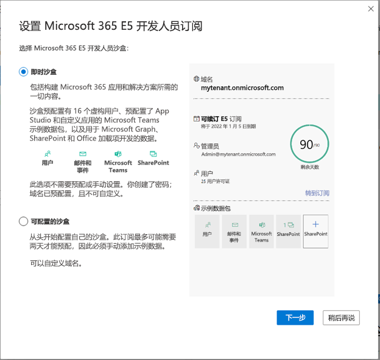

# 设置 Microsoft 365 开发人员沙盒订阅 

设置 Microsoft 365 开发人员沙盒，构建独立于生产环境的解决方案。 开发人员计划会员资格（你能够以普通会员身份或通过 Visual Studio 企业加入）包含具有 25 个用户许可证的 Microsoft 365 E5 开发人员沙盒订阅。 许可证有效期为 90 天，仅可用于开发目的（编码解决方案）。 不支持商业交易，包括购买付费服务。

> [!NOTE] 
> 若要设置订阅，必须先直接或者通过 Visual Studio Professional 或 Enterprise 订阅（如果你已订阅）[加入 Microsoft 365 开发人员计划](microsoft-365-developer-program.md)。 加入后，即可看到设置订阅的选项。

你可以选择设置即时沙盒或可配置沙盒。

## 即时沙盒

如果选择即时沙盒，你可以将沙盒配置时间从几天缩短到几秒钟。 Microsoft 365 即时沙盒预先配置了 Microsoft Teams、SharePoint、Outlook 和 Office。 它还包括适用于 24 名测试用户和一名管理员的许可证，以及适用于电脑和 Mac 的最新 Microsoft 365 应用，包括 Power Apps、Power BI、企业移动性 + 安全性、Office 365 高级威胁防护和 Azure Active Directory。

此外，你可以获取预安装的示例数据，包括新的 Teams 示例数据包，以及 Microsoft Graph 用户、邮件和日历数据及 SharePoint 框架示例数据，这些都会模拟小型企业环境来帮助你跨 Microsoft 365 平台构建解决方案。 有关详细信息，请参阅开发人员沙盒示例数据。

> [!VIDEO https://www.microsoft.com/en-us/videoplayer/embed/RWOmCY]

如果选择此选项，则不能自定义域名。

## 可配置沙盒

如果选择可配置沙盒，则可以自定义域名。 你将具有一个空沙盒，该沙盒须使用示例数据填充。 此沙盒最多可能需要两天的预配时间。 可以选择逐个安装开发人员计划仪表板上提供的示例数据包。 有关详细信息，请参阅开发人员沙盒示例数据。

## 设置 Microsoft 365 E5 沙盒订阅

若要获取 Microsoft 365 开发人员订阅，请执行以下操作：

1. 在配置文件页上，选择“**设置 E5 订阅**”。

2. 在“**设置 Microsoft 365 E5 开发人员订阅**”对话框中，选择需要即时沙盒还是可配置沙盒，然后选择“**下一步**”。

    

如果选择即时沙盒，则：

1.  为数据中心选择 **国家/地区**，并提供 **管理员用户名** 和 **管理员密码**，以及可选的虚拟用户的备用密码，然后选择“**继续**”。

    > [!IMPORTANT] 
    > 记下用户名和密码，因为需要用它来访问开发人员订阅。

2.  提供有效的手机号码，然后选择“**发送代码**”。 输入你收到的代码，然后选择“**设置**”。

    > [!NOTE] 
    > 必须使用有效的手机号码，而不是 IP 语音 (VoIP)。

3.  创建好订阅后，订阅域名和到期日期会出现在配置文件页。

如果选择可配置沙盒，则：

1.  选择 **国家/地区**，然后在“**创建用户名**”字段中提供用户名，在“**创建域字段**”中提供域名。 创建并确认密码，然后选择“**继续**”。

    > [!IMPORTANT] 
    > 记下用户名和密码，因为需要用它来访问开发人员订阅。

2.  提供有效的手机号码，然后选择“**发送代码**”。 输入你收到的代码，然后选择“**设置**”。
3.  创建好订阅后，订阅域名和到期日期会出现在配置文件页。

## 配置订阅

1. 在配置文件页，选择“**转到订阅**”，然后使用为开发人员订阅指定的用户 ID（例如，username@domain.onmicrosoft.com）和密码进行登录。

   > [!NOTE] 
   > 请不要使用开发人员计划帐户 ID 登录到订阅。

2. 使用应用启动器转到 [管理员中心](https://admin.microsoft.com/AdminPortal/Home#/homepage)。

3. 在管理中心主页上，选择转到“**转到引导设置**”。 这会转到 **Microsoft 365 E5 开发人员设置** 页面。

4. **安装 Office 应用**。 可以选择在电脑上安装 Office 应用。 准备就绪后，选择“**继续**”。

5. **个性化设置登录和电子邮件**。 可以将订阅连接到域，或只需使用你创建的现有子域。 准备就绪后，选择“**使用此域**”或选择“**稍后再说**”。

6. **添加新用户**。 可添加虚构或真实的用户来帮助你进行开发。 准备就绪后，选择“**添加用户并分配许可证**”。
    
    > [!NOTE]
    > 如果你有可配置订阅，设置订阅后，即可安装用户示例数据包。 用户示例数据包将在你的订阅上创建 16 个虚构用户，并包含每位用户的许可证、邮箱、姓名、元数据和照片。 有关详细信息，请参阅[开发人员沙盒示例数据](install-sample-packs.md)。

6. **向未经授权用户分配许可证**。 对于你想让其能够使用订阅的任何用户，向其授予许可证。 准备就绪后，选择“**添加用户并分配许可证**”或“**稍后再说**”。

7. **共享登录凭据**。 对于将访问订阅的任何真实用户，必须与其共享其登录凭据。 可以选择一种方法，如电子邮件、 下载或打印。 准备就绪后，选择“**继续**”。

   > [!TIP] 
   > 随后访问仪表板时，转到仪表板之前请先使用 *username@domain*.onmicrosoft.com 帐户登录。

8. 选择是否要向用户发送有关 Microsoft Teams 的电子邮件，然后选择“**继续**”。

9. **您已达到设置过程的结尾**。 已完成订阅设置。 您可以选择评价体验。 准备就绪后，选择 **转到管理员中心**。
    
   > [!NOTE] 
   > 目前，无论您在哪个国家/地区，订阅的地区默认为北美。 仍可以继续进行设置并使用开发人员订阅。

## 在可配置沙盒中预配 Microsoft 365 服务

如果你有可配置沙盒，后端服务（如 SharePoint 和 Exchange）需要一些时间来预配订阅。 在此步骤期间，应用启动器中和主页上一些图标显示为 **设置中 （此应用仍在设置中）**。 此步骤不会超过一个小时。

预配完成后，即可使用新的 Microsoft 365 订阅用于开发。 订阅 90 天后到期。 如果要延期，请查看[我的订阅将要到期时，我是否可以续订？](microsoft-365-developer-program-faq.yml#renew-subscription)

我们还建议启用版本选项以确保你可以尽快访问新的 Microsoft 365 功能。 有关详细信息，请参阅[设置标准或定向版本选项](https://support.office.com/article/set-up-the-standard-or-targeted-release-options-in-office-365-3b3adfa4-1777-4ff0-b606-fb8732101f47)。

## 设置 Microsoft Azure 帐户

对于一些 Office 解决方案，可能需要 Microsoft Azure 帐户使用 Azure 服务来构建。 这未包含在 Microsoft 365 开发人员订阅中。 若要设置免费 Azure 帐户，请参阅 [立即创建 Azure 免费帐户](https://azure.microsoft.com/free/)。

## 安装示例数据包

可以在可配置沙盒上安装示例数据包。 如果选择即时沙盒，则会预安装示例日期包。

示例数据包可自动安装构建和测试解决方案所需的数据和内容，从而节省你的时间。 其中包含虚构用户、元数据和照片，用于模拟小型企业环境。 有关可用的示例数据包及其安装方式的详细信息，请参阅[开发人员沙盒示例数据](install-sample-packs.md)。

## 另请参阅

- [使用你的订阅来构建 Microsoft 365 解决方案](build-microsoft-365-solutions.md)
- [续订即将到期的订阅](subscription-expiration-and-renewal.md)
- [Microsoft 365 开发人员计划常见问题解答](microsoft-365-developer-program-faq.yml)
