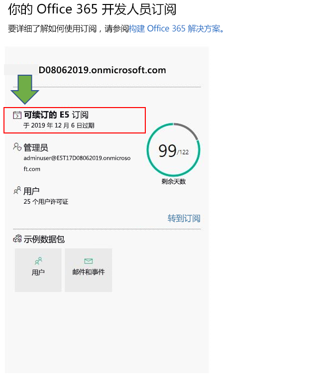

# Office 365 开发人员计划常见问题解答

以下为有关 Office 365 开发人员计划的常见问题解答。

## 什么是 Office 365 开发人员计划，以及谁应加入其中？

Office 365 开发人员计划旨在帮助你构建可以扩展 Office 365 的以人为本的跨平台生产力体验。 加入我们的计划以访问构建用于 Office 365 产品和技术的出色解决方案所需的工具、文档、培训、专家和社区活动，包括：

- [Excel](https://developer.microsoft.com/excel)、[Outlook](https://developer.microsoft.com/outlook)、[Word](https://developer.microsoft.com/word) 和 [PowerPoint](https://developer.microsoft.com/powerpoint) web 加载项
- [SharePoint](https://developer.microsoft.com/sharepoint)
- [Microsoft Teams](https://developer.microsoft.com/microsoft-teams)
- [Microsoft Graph](https://developer.microsoft.com/graph)

作为项目成员，你可以获得免费的 Office 365 开发人员订阅，可以使用 25 个用户许可证来构建解决方案。 只要你积极开发和部署解决方案，此订阅就会保持活动状态。

有关详细信息，请参阅[加入 Office 365 开发人员计划](office-365-developer-program.md)和[构建 Office 365 解决方案](build-office-365-solutions.md)。

## 可以使用什么帐户来注册 Office 365 开发人员计划？

您可以使用以下帐户类型之一注册开发人员计划：

- **Microsoft 帐户**（由本人创建供个人使用） - 提供对所有面向消费者的 Microsoft 产品和云服务，如 Outlook (Hotmail)、Messenger、OneDrive、MSN、Xbox Live 或 Office 365 的访问。 注册一个 Outlook.com 邮箱将自动创建一个 Microsoft 帐户。 创建 Microsoft 帐户后，可以用于访问消费者相关的 Microsoft 云服务或 Azure。 
- **工作帐户**（由管理员签发供企业使用） - 提供对所有小型、中型和企业业务级别 Microsoft 云服务的访问，如 Azure、 Microsoft Intune 或 Office 365。 作为组织注册此类服务时，会在 Azure Active Directory 中自动预配一个基于云的目录，来表示你的组织。 有关详细信息，请参阅 [管理 Azure AD 目录](https://docs.microsoft.com/azure/active-directory/active-directory-administer)。
- **Visual Studio ID**（为 Visual Studio Professional 或 Enterprise 订阅创建）- 我们建议使用此选项从 Visual Studio Gallery 加入此开发人员计划，充分利用 Visual Studio 订阅者的权益。 

## 如何通过开发人员计划获取 Office 365 开发人员订阅？  

如果你加入 Office 365 开发人员计划，即有资格获得免费的 Office 365 开发人员订阅。 这是一种特殊的订阅，仅用于应用程序开发。 有关详细信息，请参阅[设置 Office 365 开发人员订阅](office-365-developer-program-get-started.md)。

## 使用哪个 ID 登录开发人员计划仪表板？

使用你的会员 ID 登录开发人员计划仪表板，以访问有关你的订阅的信息。 这是你加入该计划时用于登录的 Microsoft 帐户或支持 Azure Active Directory 的电子邮件。

## 使用哪个 ID 登录开发人员订阅？

使用设置开发人员订阅时创建的管理员 ID。 可在[开发人员计划仪表板](https://developer.microsoft.com/zh-CN/office/profile)上的订阅磁贴上找到管理员 ID。

## 开发人员订阅中包含了哪些内容？

如果你在 2019 年 8 月 25 日后创建了订阅，则可获得包括 25 个用户许可证的 Office 365 E5 开发人员订阅。 在 2019 年 8 月 25 日之前加入该计划的客户可获得包括 25 个用户许可证的 Office 365 E3 开发人员订阅。

Office 365 E3 开发人员订阅包括以下内容：

- [Exchange Online（计划 2）](https://products.office.com/exchange/compare-microsoft-exchange-online-plans)
- [用于 Office 365 的流](https://flow.microsoft.com/pricing/)
- [Office 365 信息保护 - 标准](https://products.office.com/zh-CN/business/azure-information-protection-for-office-365)
- [Microsoft Forms（计划 E5）](https://support.office.com/article/Frequently-asked-questions-about-Microsoft-Forms-495c4242-6102-40a0-add8-df05ed6af61c)
- [Microsoft Planner](https://products.office.com/compare-all-microsoft-office-products?tab=2)
- [Microsoft 搜索](https://products.office.com/en-us/business/intelligent-search?tab=Discovery)
- [适用于 Office 365 E5 SKU 的 Microsoft Stream](https://products.office.com/business/office-365-enterprise-e5-business-software)
- [Microsoft Teams](https://products.office.com/business/office-365-enterprise-e5-business-software)
- [Office 365 移动设备管理](https://support.office.com/article/Set-up-Mobile-Device-Management-MDM-in-Office-365-dd892318-bc44-4eb1-af00-9db5430be3cd)
- [Office 365 专业增强版](https://products.office.com/business/office-365-proplus-business-software)
- [Office 网页版](https://docs.microsoft.com/zh-CN/office365/servicedescriptions/office-online-service-description/office-online-service-description)
- [PowerApps for Office 365](https://powerapps.microsoft.com/pricing/)
- [面向开发人员的 SharePoint Online](https://products.office.com/SharePoint/compare-sharepoint-plans)
- [Skype for Business Online（计划 2）](https://products.office.com/skype-for-business/online-meeting-solutions)
- [Sway](https://sway.com/)
- [待办事项 （计划 3）](https://todo.microsoft.com)
- [白板（计划 2）](https://products.office.com/zh-CN/microsoft-whiteboard/digital-whiteboard-app)

Microsoft 365 E5 开发人员订阅包括 Office 365 E3 开发人员订阅中包含的所有应用，以及以下新增功能:  

- Power BI 高级分析  
- 用于合规性和信息保护的企业移动性 + 安全性 (EMS)  
- Office 365 高级威胁防护 
- 用于构建高级标识和访问管理解决方案的 Azure Active Directory  

Microsoft 365 E5 开发人员订阅包括以下内容： 

- Azure Active Directory Premium P1 
- Azure Active Directory Premium P2 
-   Azure 高级威胁防护 
-   Azure 信息保护高级版 P1 
-   Azure 信息保护高级版 P2 
-   客户密码箱 
-   Exchange Online（计划 2） 
-   Flow for Office 365 
-   适用于 Office 365 的信息保护 - 高级版 
-   适用于 Office 365 的信息保护 - 标准版 
-   Microsoft Azure Active Directory 权限 
-   Microsoft Azure 多重身份验证 
-   Microsoft 云应用安全 
-   Microsoft Forms（计划 E5） 
-   Microsoft Intune 
-   Microsoft MyAnalytics（完整版） 
-   Microsoft Planner 
-   Microsoft StaffHub 
-   Microsoft Stream for O365 E5 SKU 
-   Microsoft Teams 
-   Office 365 移动设备管理 
-   Office 365 高级电子数据展示 
-   Office 365 高级安全管理 
-   Office 365 高级威胁防护（计划 1） 
-   Office 365 高级威胁防护（计划 2） 
-   Office 365 特权访问管理 
-   Office 365 专业增强版 
-   Office Online 
-   电话系统 
-   Power BI Pro 
-   PowerApps for Office 365 计划 3 
-   SharePoint Online（计划 2） 
-   Skype for Business Online (计划 2) 
-   Sway 
-   微软待办（计划 3） 
-   白板（计划 3） 
-   Yammer 企业版 

可在[仪表板](https://developer.microsoft.com/office/profile)的订阅磁贴上看到你订阅的是 Microsoft 365 E5 还是 Office 365 E3。 该磁贴将在订阅域名下显示 E3 或 E5。

。

## 订阅还包括对 Azure 的订阅吗？

此项优惠不包括 Azure 的订阅。 但是，若要接受免费访问 Azure 服务，您可以 [创建一个免费的 Azure 帐户](https://azure.microsoft.com/free/)。 

## Office 365 开发人员订阅包括多少个用户许可证？

Office 365 开发人员订阅包括 25 个用户许可证（包括管理员），仅用于开发。 如果将此订阅用于应用程序开发外的其他用途，会被视为违反许可证协议。 有关许可限制的更多详细信息，请参阅 [Office 365 开发人员订阅使用条款](terms-and-conditions.md)。

## 我的订阅有效期多长，何时会过期？

你的订阅可使用 90 天，并且基于有效开发人员活动续订。 如果正在将订阅用于开发，订阅将每 3 个月续订一次，可以无限期延期。 在 [Office 365 开发人员计划仪表板](https://developer.microsoft.com/zh-CN/office/profile)上，可以找到订阅到期日期以及订阅的名称。 有关详细信息，请参阅[订阅到期和续订](subscription-expiration-and-renewal.md)。

如果通过 Visual Studio Enterprise 或 Visual Studio Professional 加入计划，订阅将自动续订，直到 Visual Studio subscription 到期。 

## 为什么不提供一年订阅？

2019 年 4 月，我们转移到了新的模式：你的订阅可以以 90 天为周期永久续订，只要你积极地将此订阅用于开发。 我们认为此模式可确保积极开发解决方案的开发人员拥有可满足其使用期限要求的订阅。 如果你频繁进行开发，订阅将永不过期，订阅会自动延期。 如果你在短期内进行开发，你的订阅过期并被删除，可以注册新的订阅。 

如果你希望拥有长期可用的订阅，建议你获取 Visual Studio Professional 或 Visual Studio Enterprise 订阅。 这些计划包括免费的 Office 365 开发人员订阅，该订阅在 Visual Studio 订阅有效期内可用。 要访问此订阅，请转到 [Visual Studio | 我的权益](https://my.visualstudio.com/benefits). 有关详细信息，请联系 [Visual Studio 客户服务](https://www.visualstudio.com/subscriptions/support/)。 

## 如何确定订阅是否可续订？

我们使用一系列算法和通过 Office 365 开发人员计划和 Office 365 开发人员订阅中你的活动获得的遥测数据，确定你是否正在积极进行开发。 我们定期查看这些遥测数据，更新你的状态，并确定你的订阅是否应延期。 

如果你认为我们未能正确跟踪你的开发活动，可以通过仪表板告诉我们。 要在仪表板警报中提交表单，告诉我们你将订阅用于开发的情况，请选择“**告诉我们**”链接，如下图所示。 我们将审阅你的请求，如果你符合延期条件，我们会通知你。 

 

## 你们如何定义开发活动？

通过 Office 365 开发人员计划和 Office 365 开发人员订阅中你的活动确定你是否正在积极开发，以及是否应将你的订阅延期。 

要详细了解我们跟踪的活动类型，请参阅 [Office 365 开发人员订阅使用条款](terms-and-conditions.md)。 

## 我的订阅将要到期时，我是否可以续订？

订阅延期的唯一方式是进行有效的开发人员活动。 如果正在使用订阅开发自定义解决方案，订阅将过期并最终被删除。 

有关详细信息，请参阅[订阅到期和续订](subscription-expiration-and-renewal.md)。

## 如果我的订阅将要过期，多长时间后会被删除？

订阅过期后，你有 30 天时间迁移数据。 之后 30 天，仅管理员可访问此订阅，在第 60 天时，订阅和所有数据将被删除。

## 如何从 Office 365 E3 订阅迁移到 Microsoft 365 E5 订阅？

目前，仅新的 Office 365 开发人员计划成员能自动获得 Microsoft 365 E5 开发人员订阅。 我们将向现有用户提供一种迁移到 Microsoft 365 E5 订阅的方法。 请放心，我们正在致力于帮助所有 Office 365 开发人员计划成员迁移到 Microsoft 365 E5。 

## 是否可以在 Office 365 E3 和 Microsoft 365 E5 订阅两者之间进行选择？

目前，仅向新的开发人员计划成员提供 Microsoft 365 E5 订阅。 订阅 Office 365 E3 的现有成员如果不需要 Microsoft 365 E5 中提供的新功能，可以选择保留其当前订阅并继续续订。 开发人员计划成员只能享有一个订阅。  

当我们为现有开发人员计划成员提供迁移选项时，我们将提供有关如何迁移的详细信息。 

## 作为 Microsoft 合作伙伴，我可以接收订阅吗？ 

是的，您可以按照 [以下说明操作](office-365-developer-program.md) 加入 Office 365 开发人员计划并设置 Office 365 开发人员订阅。 但是，如果已拥有 Visual Studio Enterprise 或 Visual Studio Professional (MSDN) 订阅，那么 Office 365 开发人员订阅也可作为有益补充。 要访问此订阅，请转到 [Visual Studio | 我的权益](https://my.visualstudio.com/benefits). 有关详细信息，请联系 [Visual Studio 客户服务](https://www.visualstudio.com/subscriptions/support/)。 

## 作为 Microsoft 全职员工，我可以接收订阅吗？

Microsoft 员工无法注册此项优惠。 所有 Microsoft 全职员工都有权访问包含 Microsoft 365 E5 开发人员订阅访问权限在内的的免费 Visual Studio (MSDN) 订阅。 你可以在 [Visual Studio |My Benefits](https://my.visualstudio.com/benefits) 获得此权益。

## 作为在 Microsoft 工作的供应商，有没有资格接收订阅？

是的，您可以按照 [以下说明操作](office-365-developer-program.md) 加入 Office 365 开发人员计划并设置 Office 365 开发人员订阅。 即使对于供应商，此订阅_仅用于应用程序开发_。 如果没有进行有效的开发活动，订阅将不会续订。

## 该 Office 365 开发人员计划是否提供我的语言版本？

除英语外，Office 365 开发人员计划提供以下语言：中文（简体）、法语、德语、日语、葡萄牙语（巴西）、俄语和西班牙语。

## 该 Office 365 开发人员订阅是否提供我的语言版本？

Office 365 开发人员订阅仅提供英语版本。

## 支持

如果设置订阅时有问题，请参阅下列支持资源：

- [Stack Overflow](https://stackoverflow.com/questions)   
- [Visual Studio 客户服务](https://www.visualstudio.com/subscriptions/support/)

## 另请参阅

- [加入 Office 365 开发人员计划](office-365-developer-program.md)
- [设置 Office 365 开发人员订阅](office-365-developer-program-get-started.md)
- [使用您的订阅来构建 Office 365 解决方案](build-office-365-solutions.md)
- [续订即将到期的订阅](subscription-expiration-and-renewal.md)

 

 

 

 

 

 
