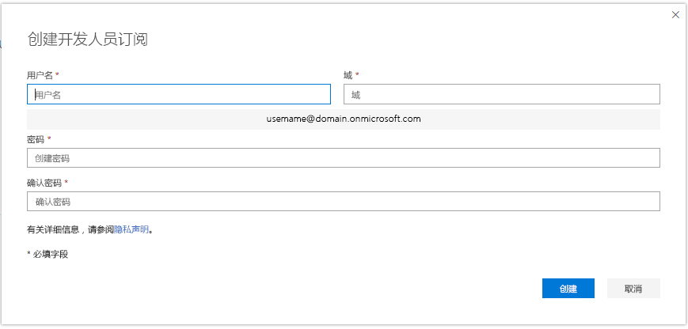
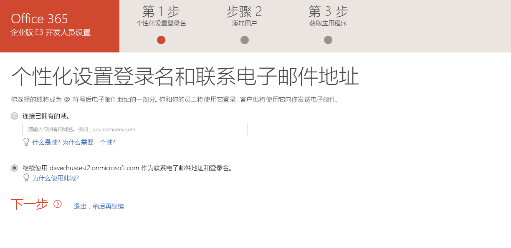
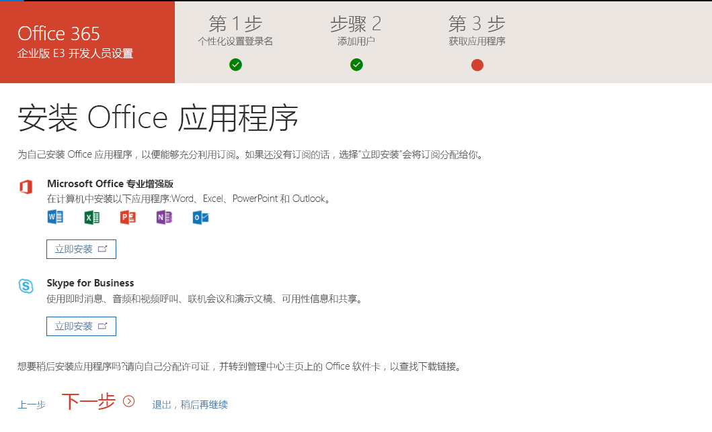

# 设置 Office 365 开发人员订阅Sign up for an Office 365 developer subscription 

设置 Office 365 开发人员订阅，构建和测试独立于您的生产环境的解决方案。Set up an Office 365 developer subscription to build and test your solutions independent of your production environment. 此订阅为 Office 365 Enterprise E3 Developer 订阅，随附 25 个用户许可证。The subscription is an Office 365 Enterprise E3 Developer subscription with 25 user licenses. 许可证有效期一年，可免费用于开发目的 （编码和测试解决方案）。It lasts for one year and is free to use for development purposes (coding and testing solutions).

> [!NOTE] 
> 若要设置订阅，必须先 [加入 Office 365 开发人员计划](office-365-developer-program.md)。To set up a subscription, you must first [join the Office 365 Developer Program](office-365-developer-program.md). 加入后，即可看到设置订阅的选项。After joining, you'll see the option to set up a subscription.

## 设置订阅Set up your Windows Azure subscription

1. 若要获得 Office 365 开发人员订阅，在配置文件页面上，在 **需要 Office 365 订阅用于开发？**，选择**设置订阅**。To get an Office 365 developer subscription, on your profile page, under **Need an Office 365 subscription to use for development?**, choose **Set up subscription**.

  

2. 在 **设置开发人员订阅** 对话框中，创建一个用户名和域。In the **Set up your developer subscription** dialog box, create a username and domain. 此帐户必须具有订阅的全局管理员权限。This account will have global administrator permissions for the subscription. 可选择任何用户名或域名（只要没有被用过）。You can choose any username or domain name as long as it is not already in use. 请勿使用空格。Do not use.

  

3. 创建并确认密码。Create and confirm a password.

4. 选择 **设置**。Choose **Set up**.

5. 如果要求你证明你不是机器人，请按照说明，然后选择 **验证**。If you are asked to prove you're not a robot, follow the instructions, and then choose **Verify**.

6. 创建好订阅后，订阅名称和到期日期会出现在配置文件页。After the subscription is created, your subscription name and expiration date appear on your profile page.

  > [!IMPORTANT]
  > 记下用户名和密码，因为需要用它来访问开发人员订阅。Make a note of your username and password because you'll need it to access your developer subscription.

## 配置订阅Configure the subscription

1. 在配置文件页，选择 [office.com](https://www.office.com/) 链接，然后使用开发人员订阅指定的用户 ID（例如，username@domain.onmicrosoft.com）和密码登录。On your profile page, choose the [office.com](https://www.office.com/) link and sign in with your user ID (for example, username@domain.onmicrosoft.com) and the password you specified for your developer subscription.

   > [!NOTE] 
   > 请不要使用开发人员计划凭据登录到订阅。Do not sign in to your subscription with your developer program credentials.

2. 使用应用启动器转到 [管理员中心](https://portal.office.com/adminportal/home#/homepage)。Use the app launcher to go to the [Admin center](https://portal.office.com/adminportal/home#/homepage).

3. 在管理员中心主页上，选择 **转到设置**。On the Admin center home page, choose **Go to setup**. 这将转到 **Office 365 Enterprise E3 Developer 设置** 页面。This will take you to the **Office 365 Enterprise E3 Developer Setup** page.

4. **个性化设置登录和电子邮件**。**Personalize your sign-in and email**. 可以将订阅连接到域，或只需使用你创建的现有子域。You can connect your subscription to a domain, or just use the existing subdomain that you created. 准备就绪后，选择 **下一步**。When ready, choose **Next**.

  

5. **添加新用户**。**Add new users**. 可以添加用户。You can add users or other groups. 既有可能是需要进行测试用的虚拟用户，也可能是帮助开发的真实用户。These could be fictional users that you need for testing, or real users helping you with development. 准备就绪后，选择 **下一步**。When ready, choose **Next**.
    
  > [!NOTE]
  > 如果需要批量添加用户，可以稍后再执行此操作。If you need to bulk-add users, you can do this later. 有关详细信息，请参阅 [将用户逐一或批量添加到 Office 365 — 管理员帮助](https://support.office.com/zh-CN/article/add-users-individually-or-in-bulk-to-office-365-admin-help-1970f7d6-03b5-442f-b385-5880b9c256ec)。For more information, see [Add users individually or in bulk to Office 365 - Admin Help](https://support.office.com/zh-CN/article/add-users-individually-or-in-bulk-to-office-365-admin-help-1970f7d6-03b5-442f-b385-5880b9c256ec).

6. **向未经授权用户分配许可证**。**Assign licenses to unlicensed users**. 对于你想让其能够使用订阅的任何用户，向其授予许可证。For any users that you want to be able to work with the subscription, grant them a license. 准备就绪后，选择 **下一步**。When ready, choose **Next**.

7. **共享登录凭据**。**Share sign-in credentials**. 对于将访问订阅的任何真实用户，必须与其共享其登录凭据。For any real users who will access the subscription, you must share their sign-in credentials with them. 可以选择一种方法，如电子邮件、 下载或打印。You can choose a method, such as email, download, or print. 准备就绪后，选择 **下一步**。When ready, choose **Next**.

8. **安装 Office 应用**。**Install your Office apps**. 可以选择在电脑上安装 Office 应用。You have the option of installing Office apps to your computer. 准备就绪后，选择 **下一步**。When ready, choose **Next**.

  

   > [!NOTE] 
   > 随后访问仪表板时，转到仪表板之前请用你*username@domain*. onmicrosoft.com 帐户。On subsequent visits to the Dashboard, sign in with your *username@domain*.onmicrosoft.com account before you go to the Dashboard.

9. **您已达到设置过程的结尾**。**You've reached the end of setup**. 已完成订阅设置。You've completed the setup for your subscription. 您可以选择评价体验。You can optionally rate the experience. 准备就绪后，选择 **转到管理员中心**。When ready, choose **Go to the Admin center**.
    
   > [!NOTE] 
   > 目前，无论您在哪个国家/地区，订阅的地区默认为北美。At this time, the subscription's region defaults to North America regardless of which country/region you are in. 仍可以继续进行设置并使用开发人员订阅。You can still proceed with setting up and using your developer subscription.

## 预配 Office 365 服务Provision Office 365 services

后端服务需要一些时间来预配订阅，例如 SharePoint 和 Exchange。It will take some time for the backend services, such as SharePoint and Exchange, to provision for the subscription. 在此步骤期间，应用启动器中和主页上一些图标显示为**设置中 （此应用仍在设置中）**。During this step, some of the icons in the app launcher and on the Home page show as **Setting up (This app is still being set up)**. 此步骤不会超过一个小时。This will take no longer than an hour.

预配完成后，即可使用新的 Office 365 订阅用于开发和测试。When the provisioning is complete, you can use the new Office 365 subscription for development and testing. 订阅一年之后到期。The subscription expires after one year.

我们还建议启用版本选项以确保您可以尽快访问新的 Office 365 功能。We also recommend that you enable release options to ensure that you get access to the latest Office 365 features as soon as possible. 有关详细信息，请参阅 [在 Office 365 中设置标准或定向版本选项](https://support.office.com/en-us/article/set-up-the-standard-or-targeted-release-options-in-office-365-3b3adfa4-1777-4ff0-b606-fb8732101f47?ui=en-US&rs=en-US&ad=US)。For more information, see [Set up the Standard or Targeted release options in Office 365](https://support.office.com/en-us/article/set-up-the-standard-or-targeted-release-options-in-office-365-3b3adfa4-1777-4ff0-b606-fb8732101f47?ui=en-US&rs=en-US&ad=US).

## 设置 Microsoft Azure 帐户Set up a Microsoft Azure account

对于一些 Office 解决方案，可能需要 Microsoft Azure 帐户使用 Azure 服务来构建和测试。For some Office solutions, you might need a Microsoft Azure account to build and test using Azure services. 若要设置免费 Azure 帐户，请参阅 [立即创建 Azure 免费帐户](https://azure.microsoft.com/zh-CN/free/)。To set up a free Azure account, see [Create your Azure free account today](https://azure.microsoft.com/zh-CN/free/).

## 脱离开发人员计划Leave the Developer Program

如果决定不再加入 Office 365 开发人员计划，可以结束订阅并脱离计划。If you decide that you no longer want to participate in the Office 365 Developer Program, you can end your subscription and leave the program.

  > [!WARNING]
  > 以下步骤将擦除所有配置文件信息。The following steps will erase all of your profile information. 您存储在开发人员订阅中的任何数据都会丢失，且不会在其他位置备份。You will lose any data stored in your developer subscription that is not backed up elsewhere.

1. 登录开发人员计划。Sign in to the Developer Program.

2. 选择 **删除配置文件**。Choose **Delete Profile**.

3. 在 **删除配置文件** 确认框中，选择**删除**。In the **Delete Profile** confirmation box, choose **Delete**.

## 另请参阅See also

- [加入 Office 365 开发人员计划Join the Office 365 Developer Program](office-365-developer-program.md)
- [使用您的订阅来构建 Office 365 解决方案Use your subscription to build Office 365 solutions](build-office-365-solutions.md)
- [Office 365 开发人员计划常见问题解答Office 365 Developer Program FAQ](office-365-developer-program-faq.md)
