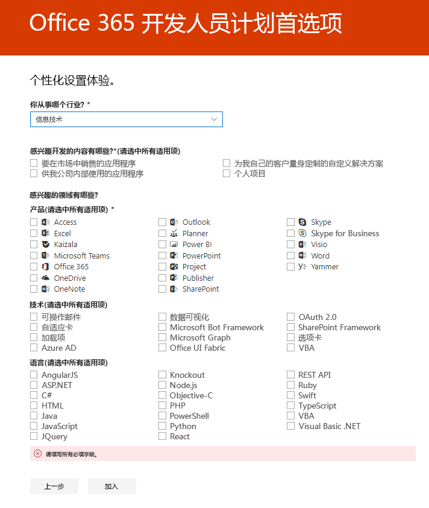

# 欢迎加入 Office 365 开发人员计划

和您的朋友同事一起加入 Office 365 开发人员计划。 使用 Office 365 开发人员订阅，开发独立于你的生产环境的解决方案。 您可以构建 Microsoft Teams、Office Add-ins、Microsoft Graph、SharePoint Framework、SharePoint Add-ins 以及更多解决方案。

## 加入 Office 365 开发人员计划

1. 前往 [加入 Office 365 开发人员计划](https://developer.microsoft.com/office/dev-program) 页面。 

2. 在右上角，选择 **登录** 以使用 Microsoft 帐户或启用了 Azure Active Directory 的电子邮件登录。 

  

3. 登录后，选择 **立即加入**。

4. 在 **Office 365 开发人员计划注册** 页面，填写在线表单的以下字段：

  - **联系人电子邮件**
  - **国家/地区**
  - **公司**

  

5. 审阅 **条款和条件**。 在加入之前您需要选中复选框。

6. 或者，如果您想要从 Microsoft 收听有关新的功能和其他更新，选择 **我想收听 Office 365 开发人员程序** 复选框。 

7. 选择 **下一步**。

8. 在 **Office 365 开发人员计划首选项** 页面上，告诉我们您的首选项，以便我们根据您的体验来个性化设置，包括：

  - 您所在的行业。
  - 你有兴趣开发的应用程序或解决方案类型。
  - 您感兴趣的产品、 技术和编程语言。

  

9. 完成后，选择 **加入**。 您的首选项会出现在下一页面右上角，并且会收到一条欢迎消息。

  

## 后续步骤

- [设置 Office 365 开发人员订阅](office-365-developer-program-get-started.md)。 

- 完成开发人员订阅后，[使用您的订阅](build-office-365-solutions.md) 构建您想要的解决方案类型。

- 有关即将到期的订阅的信息，请参阅[订阅到期和续订](subscription-expiration-and-renewal.md)。

- 有关 Office 365 开发人员计划的常见问题解答，请参阅 [常见问题解答](office-365-developer-program-faq.md)。

