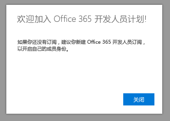

# 欢迎加入 Office 365 开发人员计划Welcome to the Office 365 Developer Program

和您的朋友同事一起加入 Office 365 开发人员计划。Join your friends and colleagues in the Office 365 Developer Program. 使用 Office 365 开发人员订阅，开发和测试独立于您的生产环境的解决方案。Use the Office 365 developer subscription to develop and test your solutions independent of your production environment. 您可以构建 Microsoft Teams、Office Add-ins、Microsoft Graph、SharePoint Framework、SharePoint Add-ins 以及更多解决方案。You can build solutions for Microsoft Teams, Office Add-ins, Microsoft Graph, SharePoint Framework, SharePoint Add-ins, and more.

## 加入 Office 365 开发人员计划Join the Office 365 Developer Program

1. 前往 [加入 Office 365 开发人员计划](https://developer.microsoft.com/zh-CN/office/dev-program) 页面。Go to the [Join the Office 365 Developer Program](https://developer.microsoft.com/zh-CN/office/dev-program) page. 

2. 在右上角，选择 **登录** 以使用 Microsoft 帐户或启用了 Azure Active Directory 的电子邮件登录。In the upper-right corner, choose **Sign in** to sign in with your Microsoft account or Azure Active Directory-enabled email. 

  

3. 登录后，选择 **立即加入**。After signing in, choose **Join now**.

4. 在 **Office 365 开发人员计划注册** 页面，填写在线表单的以下字段：On the **Office 365 Developer Program Signup** page, complete the following fields in the online form:

  - **联系人电子邮件****Contact Email**
  - **国家/地区****Country/Region**
  - **公司****Company**

  

5. 审阅 **条款和条件**。Review the **terms and conditions**. 在加入之前您需要选中复选框。You'll need to select the check box before you can join.

6. 或者，如果您想要从 Microsoft 收听有关新的功能和其他更新，选择 **我想收听 Office 365 开发人员程序** 复选框。Optionally, select the **I would like to hear from the Office 365 Developer Program** check box if you want to hear from Microsoft about new capabilities and other updates. 

7. 选择 **下一步**。Choose **Next**.

8. 在 **Office 365 开发人员计划首选项** 页面上，告诉我们您的首选项，以便我们根据您的体验来个性化设置，包括：On the **Office 365 Developer Program Preferences** page, tell us your preferences so we can personalize your experience, including:

  - 您所在的行业。The industry that you work in.
  - 您有开发兴趣的应用程序或解决方案类型。The type of applications or solutions you're interested in developing.
  - 您感兴趣的产品、 技术和编程语言。Products, technologies, and programming languages that you're interested in.

  

9. 完成后，选择 **加入**。When you're finished, choose **Join**. 您的首选项会出现在下一页面右上角，并且会收到一条欢迎消息。Your preferences appear on the next page in the top right, and you receive a Welcome message.

  

## 后续步骤Next steps

- [设置 Office 365 开发人员订阅](office-365-developer-program-get-started.md)。[Set up an Office 365 developer subscription](office-365-developer-program-get-started.md). 

- 完成开发人员订阅后，[使用您的订阅](build-office-365-solutions.md) 构建您想要的解决方案类型。After you have your developer subscription, [use your subscription](build-office-365-solutions.md) to build the types of solutions that you want.

- 有关 Office 365 开发人员计划的常见问题解答，请参阅 [常见问题解答](office-365-developer-program-faq.md)。For frequently asked questions about the Office 365 Developer Program, see the [FAQ](office-365-developer-program-faq.md). 
