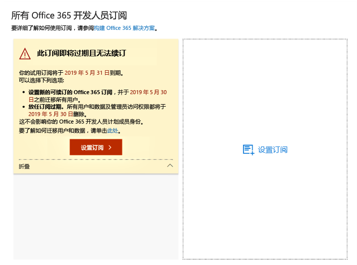
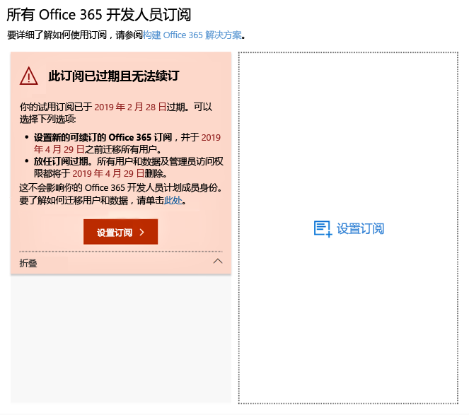
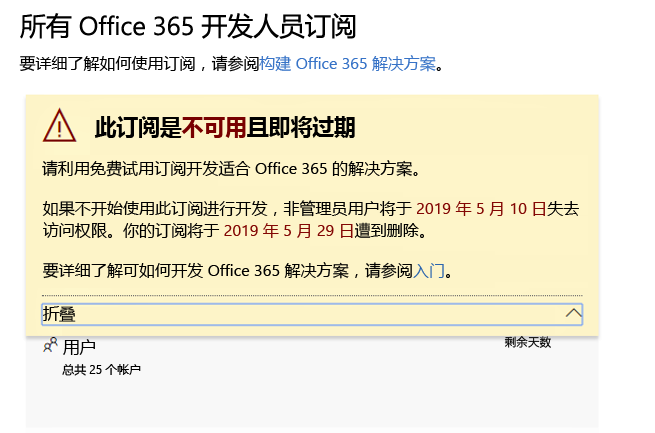
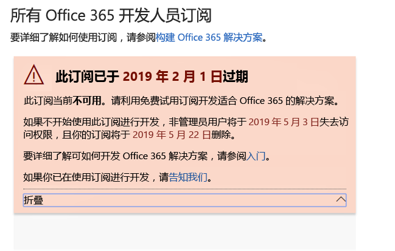
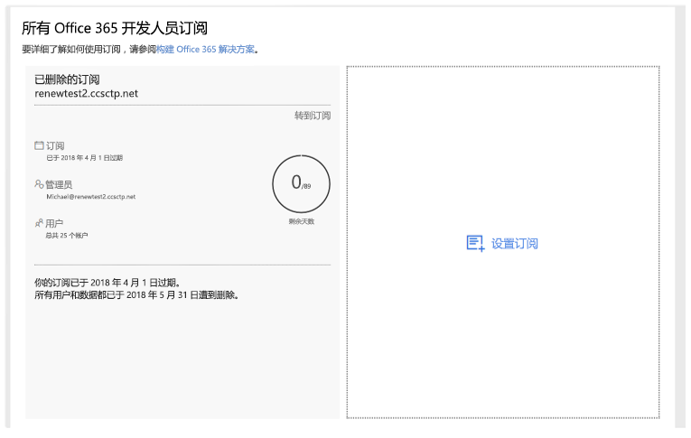

# Microsoft 365 开发人员计划订阅到期和续订

Microsoft 365 开发人员计划成员身份包括免费的 Office 365 E3 或 Microsoft 365 E5 开发人员订阅。 可以基于开发活动续订开发人员订阅；但是，一些较早的订阅确实会过期。 本文介绍可续订的订阅和不可续订的订阅之间的区别，以及如何在订阅到期时更新订阅。

## 即将过期的与可续订的开发人员订阅

随着 Microsoft 365 开发人员计划的推出，我们提供了 12 个月的开发人员订阅，这些订阅在到期时无法续订。 2018 年 8 月，我们开始向一些开发人员计划成员提供可续订的订阅。

从 2019 年 4 月开始，我们提供 90 天的可续订订阅。

可以通过查看 [Microsoft 365 开发人员计划仪表板](https://aka.ms/DevProgramDashboard)来确定是否拥有可续订或不可续订的订阅。

## 不可续订的订阅

如果在 2018 年 8 月之前注册了订阅，那么订阅不可续订，你将在仪表板上看到以下警告。 需要在当前订阅过期之前替换订阅。 警告文本将指示无法续订订阅。 我们也会通过电子邮件的形式提醒你订阅即将到期。
 
 

订阅过期时，你将看到以下警告文本。

 

若要创建替换订阅，请选择“设置订阅”。 

此外，还需要迁移需保存到新订阅的所有重要数据。 有关详细信息，请参阅本主题后面的[如何迁移我的数据？](#migrate-data)。

## 可续订的订阅

如果你在 2018 年 8 月之后注册了订阅，则可能会有可续订的订阅。 如果订阅处于非活动状态，你将在仪表板上看到以下警告。 

 

订阅过期时，你将看到以下警告文本。

 

如果你是活跃的开发人员，则你的订阅将从最初的过期日期开始再自动续订 90 天。 

## 为什么我的当前订阅不可续订？

我们在 2018 年 8 月引入了可续订的订阅。如果在此之前注册了订阅，则该订阅不可续订，需要在订阅到期时设置新的订阅。

## 订阅到期后，如何迁移我的数据？

若要将数据从当前订阅迁移到新订阅，请参阅以下资源：

- [如何将邮箱从一个租户迁移到另一个租户](/exchange/mailbox-migration/migrate-mailboxes-across-tenants)
- [使用 PowerShell 执行暂存迁移](/office365/enterprise/powershell/use-powershell-to-perform-a-staged-migration-to-office-365)
- [从一个订阅迁移到另一个订阅（不通过第三方）](https://social.technet.microsoft.com/Forums/en-US/ee507441-eb91-4b0a-ba6c-5bd9bb8c71b1/migration-from-one-o365-tenant-to-another-o365-without-third-party?forum=onlineservicesmigrationandcoexistence)

## 如何知道我的订阅是否已被删除？

当订阅被删除时，你将在仪表板上看到一个通知，指示已删除订阅及其 ID，如下面的屏幕截图所示。 

 

## 另请参阅

- [加入 Microsoft 365 开发人员计划团队](microsoft-365-developer-program.md)
- [设置 Microsoft 365 开发人员订阅](microsoft-365-developer-program-get-started.md)
- [使用你的订阅来构建 Microsoft 365 解决方案](build-microsoft-365-solutions.md)
- [Microsoft 365 开发人员计划常见问题解答](microsoft-365-developer-program-faq.yml)

